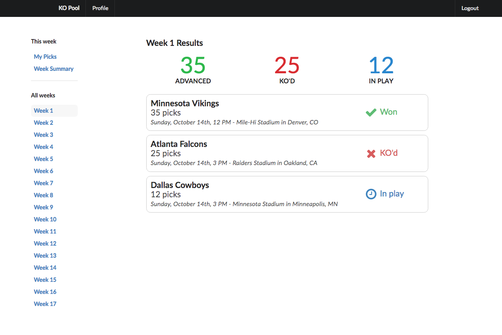

# Welcome to the KO Pool!

I originally started this project years ago for a family friend. He hosts a "knockout pool" each year during the NFL Season.

The game is simple: each week of the NFL season you must pick one team that will win. If that team wins then you advance to the next week. If that team loses or ties then you're knocked out!

Although the game is simple, there are some fun pieces of the code. The "commish" or manager of the pool has admin rights to score each matchup and control when picks are locked. Participants can only see the picks for each week starting at 11 AM on Sunday morning. It makes for some exciting games to watch on Sunday!

### Tech Stack

This new project is built with:

* Rails 5.2
* `react_on_rails` gem using webpacker
* React.js with React Router V4
* `jwt` gem for Javascript Web Token authorization
* Apollo and GraphQL

### Code Breakdown

The core of the project is a Rails 5 application with a React frontend. There are a few important models:

 * We create a new `season` each calendar year that corresponds to an NFL season. Each `season` has 17 `weeks`.
 * Each `week` has a set of `matchups` that represent every game that will happen during that week of the NFL season. Each `matchup` `belongs_to` three `NflTeam` objects: a `home_team`, `away_team`, and `winning_team`.
 * Every `user` can "enter" one or more `pool_entries` at the beginning of each NFL season. A single "pool entry" allows you to choose a single NFL team that will win on a given week. Some `users` elect to enter multiple `pool_entries` in each `season` in order to increase their odds of winning.
 * Every `week` the `user` will log in and create one `pick` for each `pool_entry` that is still alive. The user picks an `nfl_team` that they think that will win this week. If the team wins, then that `pool_entry` will advance to the next week. If not, that `pool_entry` is completely knocked out for the season. At this point the user can only see their own picks - all picks from other users are hidden. 
 * The Admin user will log in every Sunday morning and "lock" the week at 11 AM EDT. Once the week is "locked for picks" then all of the picks for the week become public. We display a summary of the picks with the most-picked teams listed first.
 * The goal of the game is to be the last `pool_entry` standing. After Week 15 the remaining teams can elect to split the payout between themselves if all parties agree. (Note: we don't actually process any payment through the app. That's all handled by my family friend.)

### Backend

Most of the Rails models are fairly standard in this project. We have some simple validations on the [`Pick`](https://github.com/JackWCollins/kopool_react/blob/master/app/models/pick.rb) model to make sure that no picks are changed once they're locked, and a short method on [`WebState`](https://github.com/JackWCollins/kopool_react/blob/master/app/models/web_state.rb) to properly advance the week once all of the games are over.

I created a small [`MatchupProcessor`](https://github.com/JackWCollins/kopool_react/blob/master/app/services/matchup_processor.rb) service object to manage the outcome of each game. After each game is finished the Admin user will log in and mark the winning team. Any `picks` for the winning team will move on to the next week, and any `picks` for the losing team are immediately knocked out. A `tie` game means that **all** picks on the game are knocked out. Tie games make for some heartbreaking losses! 

The GraphQL queries, mutations, and types live in [`app/graphql`](https://github.com/JackWCollins/kopool_react/tree/master/app/graphql). I've written some tests for those in `test/graphql` as well.

### Frontend - [`app/javascript/bundles`](https://github.com/JackWCollins/kopool_react/tree/master/app/javascript/bundles/KOPool)

I used this project as a learning project for React and GraphQL. I am using Apollo for application-wide state management and for a GraphQL interface. The frontend is still the most work-in-progress piece, but there are a couple good pieces to demonstrate.

The [`UserWeekPicks`](https://github.com/JackWCollins/kopool_react/blob/master/app/javascript/bundles/KOPool/components/UserWeekPicks.jsx) component at `app/javascript/bundles/KOPool/components` lists the `pool_entries` that are in play for the given week. The user can click on a pool entry to create or edit their `pick` for that week until the week is locked.

The [`WeekSummary`](https://github.com/JackWCollins/kopool_react/blob/master/app/javascript/bundles/KOPool/components/WeekSummary.jsx) becomes visible once the week has been locked for picks. We display a public summary of **all** of the picks for the week. This is the most fun screen because it gives you a high level overview on which games to keep your eye on. Let's say you and five other people picked the Vikings to win, but 25 people picked the Packers instead. You'd sure want the Vikings to pull out the upset!

### Original Project

This `kopool_react` project is definitely still a work in progress. The [original version](https://github.com/JackWCollins/kopool) was written in Rails 4 and Angular JS 1.5. I haven't updated that code in years, so if you venture in there shield your eyes! 